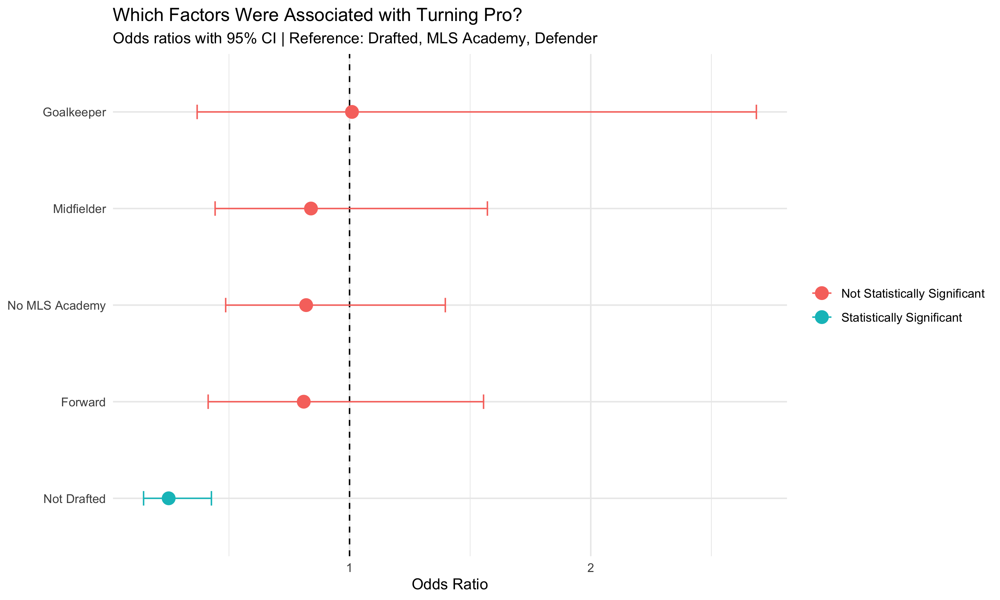

# College Soccer to Pro: 2025 MLS Eligible Player Analysis

## Project Overview

How likely is an MLS-eligible college soccer player to actually turn professional?

This project analyzes 436 college players who were eligible for the 2025 MLS SuperDraft. I researched each player's post-college outcome, verified 285 outcomes using publicly available sources, and analyzed which factors were associated with turning professional.

The project combines data collection and cleaning in Excel, data visualization in Tableau, and statistical analysis in R.

## Key Findings

- 436 players were eligible for the 2025 MLS SuperDraft.
- 285 of 436 player outcomes were verified (65.4%).
- 102 players were confirmed to have turned professional.
- 90 of 436 eligible players were drafted (20.6%).
- 12 of 436 players reached an MLS first team (2.75%).
- Drafted players were substantially more likely to reach MLS than undrafted players: 12.2% vs. 0.3%.
- Logistic regression found draft status was strongly associated with turning professional after accounting for MLS Academy background and position.
- Non-drafted players had about 75% lower odds of turning professional than drafted players (OR = 0.25, 95% CI: 0.15–0.43, p < 0.001).
- MLS Academy background was not significantly associated with turning professional in either the chi-square test (p = 0.70) or the multivariate logistic regression.

## Methodology

The analysis began with 436 players listed as eligible for the 2025 MLS SuperDraft.

Player outcomes were researched using publicly available sources, including professional club announcements, college roster pages, and other official sources. Each player was classified based on their verified post-college outcome.

Outcomes were verified for 285 players. These resolved cases were used for the statistical analysis in R.

The analysis included:

- Descriptive analysis of draft status, professional outcomes, position, and MLS Academy background.
- Data visualization using Tableau.
- A chi-square test to evaluate the relationship between MLS Academy background and turning professional.
- Multivariate logistic regression to evaluate the association between draft status, MLS Academy background, position, and the likelihood of turning professional.
- Odds ratios and 95% confidence intervals were calculated to interpret the logistic regression results.

## Limitations

Outcomes were verified for 285 of 436 eligible players (65.4%). The remaining players had unresolved outcomes due to limited or unavailable public information.

The unresolved outcomes may not be random. Players with less public coverage may be more difficult to verify, which could introduce selection bias into analyses based only on resolved outcomes.

The statistical results should therefore be interpreted as associations rather than causal relationships. Other factors not included in the dataset, such as playing time, college program strength, individual performance, combine performance, and player quality, may also influence both draft status and professional outcomes.

## Tools Used

- Excel — data collection, research tracking, cleaning, and classification
- Tableau — exploratory analysis and interactive dashboard visualization
- R — chi-square testing, logistic regression, odds ratios, confidence intervals, and statistical visualization

## Project Structure

```text
college-to-pro-2025-analysis/
├── README.md
├── college_to_pro_analysis.R
├── college-to-pro-2025-analysis.Rproj
├── Data/
│   └── eligible_players_2025.xlsx
├── Figures/
│   └── logistic_regression_forest_plot.png
└── Tableau/
    └── College_to_Pro_2025_MLS_Player_Analysis.twb
```
## Statistical Analysis

A chi-square test was used to evaluate whether MLS Academy background was associated with turning professional. The result was not statistically significant (p = 0.70).

A multivariate logistic regression was then used to evaluate draft status, MLS Academy background, and position simultaneously.

Draft status was the only statistically significant factor in the model. After accounting for academy background and position, non-drafted players had about 75% lower odds of turning professional than drafted players (OR = 0.25, 95% CI: 0.15–0.43, p < 0.001).

MLS Academy background and position were not statistically significant in the model.

Reference categories for the regression were Drafted, MLS Academy, and Defender.

## Regression Visualization

The figure below shows the estimated odds ratios and 95% confidence intervals from the logistic regression model. An odds ratio of 1 represents no difference from the reference category.



## Conclusion

The analysis shows that being drafted was the strongest factor associated with turning professional among the players with verified outcomes. Drafted players were substantially more likely to reach the professional level, while MLS Academy background and playing position were not statistically significant predictors after controlling for the other variables.

Overall, the project demonstrates how data collection, visualization, and statistical modeling can be combined to evaluate the college-to-professional soccer pathway.
